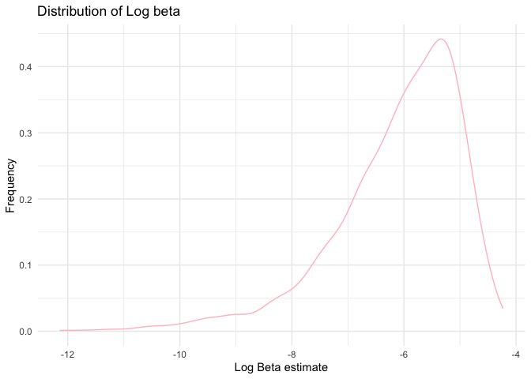
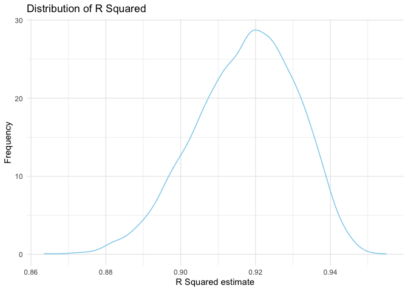
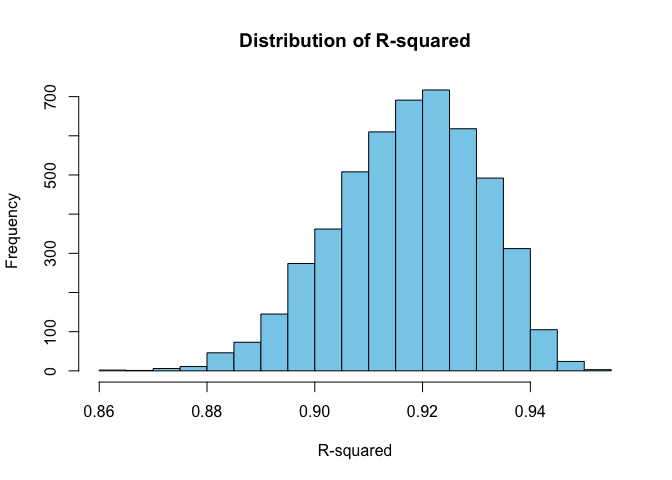

p8105_hw6_yc3577
================
Yimeng Cai
11/30/2023

``` r
library(tidyverse)
```

    ## ── Attaching core tidyverse packages ──────────────────────── tidyverse 2.0.0 ──
    ## ✔ dplyr     1.1.3     ✔ readr     2.1.4
    ## ✔ forcats   1.0.0     ✔ stringr   1.5.0
    ## ✔ ggplot2   3.4.3     ✔ tibble    3.2.1
    ## ✔ lubridate 1.9.2     ✔ tidyr     1.3.0
    ## ✔ purrr     1.0.1     
    ## ── Conflicts ────────────────────────────────────────── tidyverse_conflicts() ──
    ## ✖ dplyr::filter() masks stats::filter()
    ## ✖ dplyr::lag()    masks stats::lag()
    ## ℹ Use the conflicted package (<http://conflicted.r-lib.org/>) to force all conflicts to become errors

``` r
library(readr)
library(ggplot2)
library(broom)
library(modelr)
```

    ## 
    ## Attaching package: 'modelr'
    ## 
    ## The following object is masked from 'package:broom':
    ## 
    ##     bootstrap

``` r
library(mgcv)
```

    ## Loading required package: nlme
    ## 
    ## Attaching package: 'nlme'
    ## 
    ## The following object is masked from 'package:dplyr':
    ## 
    ##     collapse
    ## 
    ## This is mgcv 1.9-0. For overview type 'help("mgcv-package")'.

``` r
library(purrr)
library(dplyr)
library(stats)
library(boot)
```

### Problem 1

In the data cleaning code below we create a `city_state` variable,
change `victim_age` to numeric, modifiy victim_race to have categories
white and non-white, with white as the reference category, and create a
`resolution` variable indicating whether the homicide is solved. Lastly,
we filtered out the following cities: Tulsa, AL; Dallas, TX; Phoenix,
AZ; and Kansas City, MO; and we retained only the variables
`city_state`, `resolution`, `victim_age`, `victim_sex`, and
`victim_race`.

``` r
homicide_df = 
  read_csv("homicide-data.csv", na = c("", "NA", "Unknown")) |> 
  mutate(
    city_state = str_c(city, state, sep = ", "),
    victim_age = as.numeric(victim_age),
    resolution = case_when(
      disposition == "Closed without arrest" ~ 0,
      disposition == "Open/No arrest"        ~ 0,
      disposition == "Closed by arrest"      ~ 1)
  ) |> 
  filter(victim_race %in% c("White", "Black")) |> 
  filter(!(city_state %in% c("Tulsa, AL", "Dallas, TX", "Phoenix, AZ", "Kansas City, MO"))) |> 
  select(city_state, resolution, victim_age, victim_sex, victim_race)
```

    ## Rows: 52179 Columns: 12
    ## ── Column specification ────────────────────────────────────────────────────────
    ## Delimiter: ","
    ## chr (8): uid, victim_last, victim_first, victim_race, victim_sex, city, stat...
    ## dbl (4): reported_date, victim_age, lat, lon
    ## 
    ## ℹ Use `spec()` to retrieve the full column specification for this data.
    ## ℹ Specify the column types or set `show_col_types = FALSE` to quiet this message.

``` r
homicide_df
```

    ## # A tibble: 39,693 × 5
    ##    city_state      resolution victim_age victim_sex victim_race
    ##    <chr>                <dbl>      <dbl> <chr>      <chr>      
    ##  1 Albuquerque, NM          0         15 Female     White      
    ##  2 Albuquerque, NM          0         72 Female     White      
    ##  3 Albuquerque, NM          0         91 Female     White      
    ##  4 Albuquerque, NM          0         56 Male       White      
    ##  5 Albuquerque, NM          0         NA Male       White      
    ##  6 Albuquerque, NM          1         43 Female     White      
    ##  7 Albuquerque, NM          1         52 Male       White      
    ##  8 Albuquerque, NM          1         22 Female     White      
    ##  9 Albuquerque, NM          1         15 Male       Black      
    ## 10 Albuquerque, NM          1         25 Male       Black      
    ## # ℹ 39,683 more rows

Next we fit a logistic regression model using only data from Baltimore,
MD. We model `resolved` as the outcome and `victim_age`, `victim_sex`,
and `victim_race` as predictors. We save the output as `baltimore_glm`
so that we can apply `broom::tidy` to this object and obtain the
estimate and confidence interval of the adjusted odds ratio for solving
homicides comparing non-white victims to white victims.

``` r
baltimore_glm = 
  filter(homicide_df, city_state == "Baltimore, MD") |> 
  glm(resolution ~ victim_age + victim_sex + victim_race, family = binomial(), data = _)
baltimore_glm
```

    ## 
    ## Call:  glm(formula = resolution ~ victim_age + victim_sex + victim_race, 
    ##     family = binomial(), data = filter(homicide_df, city_state == 
    ##         "Baltimore, MD"))
    ## 
    ## Coefficients:
    ##      (Intercept)        victim_age    victim_sexMale  victim_raceWhite  
    ##         0.309981         -0.006727         -0.854463          0.841756  
    ## 
    ## Degrees of Freedom: 2752 Total (i.e. Null);  2749 Residual
    ## Null Deviance:       3568 
    ## Residual Deviance: 3493  AIC: 3501

``` r
baltimore_glm |> 
  broom::tidy() |> 
  mutate(
    OR = exp(estimate), 
    OR_CI_upper = exp(estimate + 1.96 * std.error),
    OR_CI_lower = exp(estimate - 1.96 * std.error)) |> 
  filter(term == "victim_sexMale") |> 
  select(OR, OR_CI_lower, OR_CI_upper) |>
  knitr::kable(digits = 3)
```

|    OR | OR_CI_lower | OR_CI_upper |
|------:|------------:|------------:|
| 0.426 |       0.325 |       0.558 |

``` r
baltimore_glm
```

    ## 
    ## Call:  glm(formula = resolution ~ victim_age + victim_sex + victim_race, 
    ##     family = binomial(), data = filter(homicide_df, city_state == 
    ##         "Baltimore, MD"))
    ## 
    ## Coefficients:
    ##      (Intercept)        victim_age    victim_sexMale  victim_raceWhite  
    ##         0.309981         -0.006727         -0.854463          0.841756  
    ## 
    ## Degrees of Freedom: 2752 Total (i.e. Null);  2749 Residual
    ## Null Deviance:       3568 
    ## Residual Deviance: 3493  AIC: 3501

Below, by incorporating `nest()`, `map()`, and `unnest()` into the
preceding Baltimore-specific code, we fit a model for each of the
cities, and extract the adjusted odds ratio (and CI) for solving
homicides comparing non-white victims to white victims. We show the
first 5 rows of the resulting dataframe of model results.

``` r
model_results = 
  homicide_df |> 
  nest(data = -city_state) |> 
  mutate(
    models = map(data, \(df) glm(resolution ~ victim_age + victim_sex + victim_race, 
                             family = binomial(), data = df)),
    tidy_models = map(models, broom::tidy)) |> 
  select(-models, -data) |> 
  unnest(cols = tidy_models) |> 
  mutate(
    OR = exp(estimate), 
    OR_CI_upper = exp(estimate + 1.96 * std.error),
    OR_CI_lower = exp(estimate - 1.96 * std.error)) |> 
  filter(term == "victim_sexMale") |> 
  select(city_state, OR, OR_CI_lower, OR_CI_upper)

model_results |>
  slice(1:5) |> 
  knitr::kable(digits = 3)
```

| city_state      |    OR | OR_CI_lower | OR_CI_upper |
|:----------------|------:|------------:|------------:|
| Albuquerque, NM | 1.767 |       0.831 |       3.761 |
| Atlanta, GA     | 1.000 |       0.684 |       1.463 |
| Baltimore, MD   | 0.426 |       0.325 |       0.558 |
| Baton Rouge, LA | 0.381 |       0.209 |       0.695 |
| Birmingham, AL  | 0.870 |       0.574 |       1.318 |

``` r
model_results
```

    ## # A tibble: 47 × 4
    ##    city_state         OR OR_CI_lower OR_CI_upper
    ##    <chr>           <dbl>       <dbl>       <dbl>
    ##  1 Albuquerque, NM 1.77        0.831       3.76 
    ##  2 Atlanta, GA     1.00        0.684       1.46 
    ##  3 Baltimore, MD   0.426       0.325       0.558
    ##  4 Baton Rouge, LA 0.381       0.209       0.695
    ##  5 Birmingham, AL  0.870       0.574       1.32 
    ##  6 Boston, MA      0.667       0.354       1.26 
    ##  7 Buffalo, NY     0.521       0.290       0.935
    ##  8 Charlotte, NC   0.884       0.557       1.40 
    ##  9 Chicago, IL     0.410       0.336       0.501
    ## 10 Cincinnati, OH  0.400       0.236       0.677
    ## # ℹ 37 more rows

Below we generate a plot of the estimated ORs and CIs for each city,
ordered by magnitude of the OR from smallest to largest. From this plot
we see that most cities have odds ratios that are smaller than 1,
suggesting that crimes with male victims have smaller odds of resolution
compared to crimes with female victims after adjusting for victim age
and race. This disparity is strongest in New yrok. In roughly half of
these cities, confidence intervals are narrow and do not contain 1,
suggesting a significant difference in resolution rates by sex after
adjustment for victim age and race.

``` r
model_results |> 
  mutate(city_state = fct_reorder(city_state, OR)) |> 
  ggplot(aes(x = city_state, y = OR)) + 
  geom_point() + 
  geom_errorbar(aes(ymin = OR_CI_lower, ymax = OR_CI_upper)) + 
  theme(axis.text.x = element_text(angle = 90, hjust = 1))
```

<!-- -->

``` r
model_results
```

    ## # A tibble: 47 × 4
    ##    city_state         OR OR_CI_lower OR_CI_upper
    ##    <chr>           <dbl>       <dbl>       <dbl>
    ##  1 Albuquerque, NM 1.77        0.831       3.76 
    ##  2 Atlanta, GA     1.00        0.684       1.46 
    ##  3 Baltimore, MD   0.426       0.325       0.558
    ##  4 Baton Rouge, LA 0.381       0.209       0.695
    ##  5 Birmingham, AL  0.870       0.574       1.32 
    ##  6 Boston, MA      0.667       0.354       1.26 
    ##  7 Buffalo, NY     0.521       0.290       0.935
    ##  8 Charlotte, NC   0.884       0.557       1.40 
    ##  9 Chicago, IL     0.410       0.336       0.501
    ## 10 Cincinnati, OH  0.400       0.236       0.677
    ## # ℹ 37 more rows

### Problem 2

For this problem, we’ll use the Central Park weather data similar to
data we’ve seen elsewhere. The code chunk below (adapted from the course
website) will download these data.

``` r
# First, we need to load in the data. 
weather_df = 
  rnoaa::meteo_pull_monitors(
    c("USW00094728"),
    var = c("PRCP", "TMIN", "TMAX"), 
    date_min = "2022-01-01",
    date_max = "2022-12-31") |>
  mutate(
    name = recode(id, USW00094728 = "CentralPark_NY"),
    tmin = tmin / 10,
    tmax = tmax / 10) |>
  select(name, id, everything())
```

    ## using cached file: /Users/christinecym/Library/Caches/org.R-project.R/R/rnoaa/noaa_ghcnd/USW00094728.dly

    ## date created (size, mb): 2023-11-30 21:48:02.57811 (8.544)

    ## file min/max dates: 1869-01-01 / 2023-11-30

``` r
weather_df
```

    ## # A tibble: 365 × 6
    ##    name           id          date        prcp  tmax  tmin
    ##    <chr>          <chr>       <date>     <dbl> <dbl> <dbl>
    ##  1 CentralPark_NY USW00094728 2022-01-01   201  13.3  10  
    ##  2 CentralPark_NY USW00094728 2022-01-02    10  15     2.8
    ##  3 CentralPark_NY USW00094728 2022-01-03     0   2.8  -5.5
    ##  4 CentralPark_NY USW00094728 2022-01-04     0   1.1  -7.1
    ##  5 CentralPark_NY USW00094728 2022-01-05    58   8.3  -0.5
    ##  6 CentralPark_NY USW00094728 2022-01-06     0   5     1.1
    ##  7 CentralPark_NY USW00094728 2022-01-07    97   1.1  -3.8
    ##  8 CentralPark_NY USW00094728 2022-01-08     0  -1    -6.6
    ##  9 CentralPark_NY USW00094728 2022-01-09    25   4.4  -1.6
    ## 10 CentralPark_NY USW00094728 2022-01-10     0   4.4  -4.3
    ## # ℹ 355 more rows

The boostrap is helpful when you’d like to perform inference for a
parameter / value / summary that doesn’t have an easy-to-write-down
distribution in the usual repeated sampling framework. We’ll focus on a
simple linear regression with tmax as the response with tmin and prcp as
the predictors, and are interested in the distribution of two quantities
estimated from these data: - r̂^ 2 - log(β̂ 1∗β̂ 2) Use 5000 bootstrap
samples and, for each bootstrap sample, produce estimates of these two
quantities.

``` r
bootstrap_sample = function(data) {
  sample_frac(data, replace = TRUE)
}


bootstrap_tibble = 
  tibble(number = 1:5000) |>
  mutate(
    sample = map(number, \(i) bootstrap_sample(weather_df)))

bootstrap_tibble
```

    ## # A tibble: 5,000 × 2
    ##    number sample            
    ##     <int> <list>            
    ##  1      1 <tibble [365 × 6]>
    ##  2      2 <tibble [365 × 6]>
    ##  3      3 <tibble [365 × 6]>
    ##  4      4 <tibble [365 × 6]>
    ##  5      5 <tibble [365 × 6]>
    ##  6      6 <tibble [365 × 6]>
    ##  7      7 <tibble [365 × 6]>
    ##  8      8 <tibble [365 × 6]>
    ##  9      9 <tibble [365 × 6]>
    ## 10     10 <tibble [365 × 6]>
    ## # ℹ 4,990 more rows

``` r
bootstrap_results1 = bootstrap_tibble |>
  mutate(
    models = map(sample, \(df) lm(tmax ~ tmin + prcp, data = df)),
    results = map(models, broom::tidy),
    r_squared = map_dbl(models, \(model) summary(model)$r.squared)) |> 
  select(-models) |> 
  unnest(results) 

bootstrap_results1
```

    ## # A tibble: 15,000 × 8
    ##    number sample   term        estimate std.error statistic   p.value r_squared
    ##     <int> <list>   <chr>          <dbl>     <dbl>     <dbl>     <dbl>     <dbl>
    ##  1      1 <tibble> (Intercept)  8.02      0.238       33.7  7.93e-114     0.919
    ##  2      1 <tibble> tmin         1.03      0.0161      63.7  1.07e-198     0.919
    ##  3      1 <tibble> prcp        -0.00596   0.00238     -2.51 1.26e-  2     0.919
    ##  4      2 <tibble> (Intercept)  8.28      0.203       40.8  1.53e-137     0.932
    ##  5      2 <tibble> tmin         1.02      0.0144      70.4  2.27e-213     0.932
    ##  6      2 <tibble> prcp        -0.00596   0.00207     -2.89 4.12e-  3     0.932
    ##  7      3 <tibble> (Intercept)  7.74      0.225       34.5  2.33e-116     0.922
    ##  8      3 <tibble> tmin         1.04      0.0159      65.1  6.21e-202     0.922
    ##  9      3 <tibble> prcp        -0.00605   0.00213     -2.84 4.82e-  3     0.922
    ## 10      4 <tibble> (Intercept)  8.34      0.241       34.7  4.07e-117     0.905
    ## # ℹ 14,990 more rows

``` r
bootstrap_results2 =
  bootstrap_results1 |>
  group_by(term) |>
  select(number, estimate, r_squared, term) |>
  pivot_wider(
    names_from = term,
    values_from = estimate
  ) |>
  mutate(
    log_beta = log(tmin * prcp)
  )
```

    ## Warning: There was 1 warning in `mutate()`.
    ## ℹ In argument: `log_beta = log(tmin * prcp)`.
    ## Caused by warning in `log()`:
    ## ! NaNs produced

``` r
bootstrap_results2
```

    ## # A tibble: 5,000 × 6
    ##    number r_squared `(Intercept)`  tmin      prcp log_beta
    ##     <int>     <dbl>         <dbl> <dbl>     <dbl>    <dbl>
    ##  1      1     0.919          8.02 1.03  -0.00596       NaN
    ##  2      2     0.932          8.28 1.02  -0.00596       NaN
    ##  3      3     0.922          7.74 1.04  -0.00605       NaN
    ##  4      4     0.905          8.34 0.989 -0.00363       NaN
    ##  5      5     0.936          8.10 1.01  -0.00737       NaN
    ##  6      6     0.935          7.98 1.02  -0.00705       NaN
    ##  7      7     0.934          7.76 1.04  -0.00693       NaN
    ##  8      8     0.891          8.49 0.990 -0.000346      NaN
    ##  9      9     0.907          8.50 0.988 -0.00781       NaN
    ## 10     10     0.932          7.76 1.03  -0.00662       NaN
    ## # ℹ 4,990 more rows

Plot the distribution of your estimates, and describe these in words.

``` r
# Then we need to draw the distribution of log_beta

beta_dist =
  bootstrap_results2 |>
  ggplot(aes(x = log_beta)) +
  geom_density(color = 'pink') +
  theme_minimal() +
  labs(
    x = 'Log Beta estimate',
    y = 'Frequency',
    title = 'Distribution of Log beta'
  )

beta_dist
```

    ## Warning: Removed 3400 rows containing non-finite values (`stat_density()`).

<!-- -->

``` r
hist(bootstrap_results2$log_beta, main = "Distribution of Log beta", xlab = "Log beta", col = "pink")
```

<!-- --> -
The distribution of Log_beta is above with Pink histogram and pink
density line. It is unimodel. From two graphs, we can see they are left
skewed distributed with a long tail on the left. The range is from -14
to -4 and the center of the mode is around -6. This suggests that there
are a few samples being strapped having a small product of beta
coefficients.

``` r
# Then we need to draw the distribution of r^2

rsquared_dist =
  bootstrap_results2 |>
  ggplot(aes(x = r_squared)) +
  geom_density(color = 'skyblue') +
  theme_minimal() +
  labs(
    x = 'R Squared estimate',
    y = 'Frequency',
    title = 'Distribution of R Squared'
  )

rsquared_dist
```

<!-- -->

``` r
hist(bootstrap_results2$r_squared, main = "Distribution of R-squared", xlab = "R-squared", col = "skyblue")
```

<!-- --> -
The distribution of R_squared is above with blue histogram and blue
density curve. It is unimodel. From two graphs, we can see they are also
left skewed a little with a small tail on the left. But the distribution
is closer to normal than the log_beta graph. The range is from 0.86 to
0.95 and the center of the mode is around 0.92.

Using the 5000 bootstrap estimates, identify the 2.5% and 97.5%
quantiles to provide a 95% confidence interval for r̂ 2 and log(β̂ 0∗β̂ 1).
Note: broom::glance() is helpful for extracting r̂ 2 from a fitted
regression, and broom::tidy() (with some additional wrangling) should
help in computing log(β̂ 1∗β̂ 2).

``` r
# Then we can construct the 95% confidence interval for rsquared
rsquared_quantile = 
  bootstrap_results2 |>
  drop_na()|>
  summarize(
    CI_Low = quantile(r_squared, 0.025),
    CI_High = quantile(r_squared, 0.975)
  )
rsquared_quantile
```

    ## # A tibble: 1 × 2
    ##   CI_Low CI_High
    ##    <dbl>   <dbl>
    ## 1  0.883   0.927

- From calculation, the 95% confidence interval for r_squared is
  (0.8828948, 0.9273118) which means that we have 95 out of 100 times
  the estimate r_squared will fall between the interval of (0.8828948,
  0.9273118).

``` r
# Then we can construct the 95% confidence interval for logbeta
logbeta_quantile = 
  bootstrap_results2 |>
  drop_na()|>
  summarize(
    CI_Low = quantile(log_beta, 0.025),
    CI_High = quantile(log_beta, 0.975)
  )
logbeta_quantile
```

    ## # A tibble: 1 × 2
    ##   CI_Low CI_High
    ##    <dbl>   <dbl>
    ## 1  -9.13   -4.60

- From calculation, the 95% confidence interval for log\_(betatmin \*
  betaprcp) is (-8.998584, -4.589433) which means that we have 95 out of
  100 times the estimate log\_(betatmin \* betaprcp) will fall between
  the interval of (-8.998584, -4.589433).

# Problem 3

In this problem, you will analyze data gathered to understand the
effects of several variables on a child’s birthweight. Load and clean
the data for regression analysis (i.e. convert numeric to factor where
appropriate, check for missing data, etc.).

``` r
# First we need to load in data and clean the table.
birthweight = 
  read_csv('birthweight.csv') |>
  janitor::clean_names() |>
  mutate(
    babysex = recode(babysex, '1' = 'male', '2' = 'female'),
    frace = recode(frace, '1' = 'White', '2' = 'Black', '3' = 'Asian', '4' = 'Puerto Rican', '8' = 'Other', '9' = 'Unknown'),
    mrace = recode(mrace, '1' = 'White', '2' = 'Black', '3' = 'Asian', '4' = 'Puerto Rican', '8' = 'Other'),
    malform = recode(malform, '0' = 'absent', '1' = 'present')
  ) |>
  drop_na()
```

    ## Rows: 4342 Columns: 20
    ## ── Column specification ────────────────────────────────────────────────────────
    ## Delimiter: ","
    ## dbl (20): babysex, bhead, blength, bwt, delwt, fincome, frace, gaweeks, malf...
    ## 
    ## ℹ Use `spec()` to retrieve the full column specification for this data.
    ## ℹ Specify the column types or set `show_col_types = FALSE` to quiet this message.

``` r
birthweight
```

    ## # A tibble: 4,342 × 20
    ##    babysex bhead blength   bwt delwt fincome frace gaweeks malform menarche
    ##    <chr>   <dbl>   <dbl> <dbl> <dbl>   <dbl> <chr>   <dbl> <chr>      <dbl>
    ##  1 female     34      51  3629   177      35 White    39.9 absent        13
    ##  2 male       34      48  3062   156      65 Black    25.9 absent        14
    ##  3 female     36      50  3345   148      85 White    39.9 absent        12
    ##  4 male       34      52  3062   157      55 White    40   absent        14
    ##  5 female     34      52  3374   156       5 White    41.6 absent        13
    ##  6 male       33      52  3374   129      55 White    40.7 absent        12
    ##  7 female     33      46  2523   126      96 Black    40.3 absent        14
    ##  8 female     33      49  2778   140       5 White    37.4 absent        12
    ##  9 male       36      52  3515   146      85 White    40.3 absent        11
    ## 10 male       33      50  3459   169      75 Black    40.7 absent        12
    ## # ℹ 4,332 more rows
    ## # ℹ 10 more variables: mheight <dbl>, momage <dbl>, mrace <chr>, parity <dbl>,
    ## #   pnumlbw <dbl>, pnumsga <dbl>, ppbmi <dbl>, ppwt <dbl>, smoken <dbl>,
    ## #   wtgain <dbl>

``` r
# Then we check whether there is na data.
summary(is.na(birthweight))
```

    ##   babysex          bhead          blength           bwt         
    ##  Mode :logical   Mode :logical   Mode :logical   Mode :logical  
    ##  FALSE:4342      FALSE:4342      FALSE:4342      FALSE:4342     
    ##    delwt          fincome          frace          gaweeks       
    ##  Mode :logical   Mode :logical   Mode :logical   Mode :logical  
    ##  FALSE:4342      FALSE:4342      FALSE:4342      FALSE:4342     
    ##   malform         menarche        mheight          momage       
    ##  Mode :logical   Mode :logical   Mode :logical   Mode :logical  
    ##  FALSE:4342      FALSE:4342      FALSE:4342      FALSE:4342     
    ##    mrace           parity         pnumlbw         pnumsga       
    ##  Mode :logical   Mode :logical   Mode :logical   Mode :logical  
    ##  FALSE:4342      FALSE:4342      FALSE:4342      FALSE:4342     
    ##    ppbmi            ppwt           smoken          wtgain       
    ##  Mode :logical   Mode :logical   Mode :logical   Mode :logical  
    ##  FALSE:4342      FALSE:4342      FALSE:4342      FALSE:4342

Propose a regression model for birthweight. This model may be based on a
hypothesized structure for the factors that underly birthweight, on a
data-driven model-building process, or a combination of the two.

``` r
# Then we propose the regression model for birthweight. 
birthweight_model = lm(bwt ~ babysex + bhead + blength + delwt + fincome + frace + gaweeks +
                          malform + menarche + mheight + momage + mrace + parity + pnumlbw +
                          pnumsga + ppbmi + ppwt + smoken + wtgain, data = birthweight)
birthweight_model
```

    ## 
    ## Call:
    ## lm(formula = bwt ~ babysex + bhead + blength + delwt + fincome + 
    ##     frace + gaweeks + malform + menarche + mheight + momage + 
    ##     mrace + parity + pnumlbw + pnumsga + ppbmi + ppwt + smoken + 
    ##     wtgain, data = birthweight)
    ## 
    ## Coefficients:
    ##       (Intercept)        babysexmale              bhead            blength  
    ##        -6306.8346           -28.7073           130.7781            74.9536  
    ##             delwt            fincome         fraceBlack         fraceOther  
    ##            4.1007             0.2898            -6.9048           -16.9392  
    ## fracePuerto Rican         fraceWhite            gaweeks     malformpresent  
    ##          -68.2323           -21.2361            11.5494             9.7650  
    ##          menarche            mheight             momage         mraceBlack  
    ##           -3.5508             9.7874             0.7593           -60.0488  
    ## mracePuerto Rican         mraceWhite             parity            pnumlbw  
    ##           34.9079            91.3866            95.5411                 NA  
    ##           pnumsga              ppbmi               ppwt             smoken  
    ##                NA             4.3538            -3.4716            -4.8544  
    ##            wtgain  
    ##                NA

``` r
# To see the model summary, we can use the summary()
summary(birthweight_model)
```

    ## 
    ## Call:
    ## lm(formula = bwt ~ babysex + bhead + blength + delwt + fincome + 
    ##     frace + gaweeks + malform + menarche + mheight + momage + 
    ##     mrace + parity + pnumlbw + pnumsga + ppbmi + ppwt + smoken + 
    ##     wtgain, data = birthweight)
    ## 
    ## Residuals:
    ##      Min       1Q   Median       3Q      Max 
    ## -1097.68  -184.86    -3.33   173.09  2344.15 
    ## 
    ## Coefficients: (3 not defined because of singularities)
    ##                     Estimate Std. Error t value Pr(>|t|)    
    ## (Intercept)       -6306.8346   659.2640  -9.566  < 2e-16 ***
    ## babysexmale         -28.7073     8.4652  -3.391 0.000702 ***
    ## bhead               130.7781     3.4523  37.881  < 2e-16 ***
    ## blength              74.9536     2.0217  37.075  < 2e-16 ***
    ## delwt                 4.1007     0.3948  10.386  < 2e-16 ***
    ## fincome               0.2898     0.1795   1.614 0.106551    
    ## fraceBlack           -6.9048    78.8349  -0.088 0.930210    
    ## fraceOther          -16.9392    97.5932  -0.174 0.862212    
    ## fracePuerto Rican   -68.2323    78.4692  -0.870 0.384599    
    ## fraceWhite          -21.2361    69.2960  -0.306 0.759273    
    ## gaweeks              11.5494     1.4654   7.882 4.06e-15 ***
    ## malformpresent        9.7650    70.6259   0.138 0.890039    
    ## menarche             -3.5508     2.8951  -1.226 0.220083    
    ## mheight               9.7874    10.3116   0.949 0.342588    
    ## momage                0.7593     1.2221   0.621 0.534418    
    ## mraceBlack          -60.0488    80.9532  -0.742 0.458266    
    ## mracePuerto Rican    34.9079    80.9481   0.431 0.666317    
    ## mraceWhite           91.3866    71.9190   1.271 0.203908    
    ## parity               95.5411    40.4793   2.360 0.018307 *  
    ## pnumlbw                   NA         NA      NA       NA    
    ## pnumsga                   NA         NA      NA       NA    
    ## ppbmi                 4.3538    14.8913   0.292 0.770017    
    ## ppwt                 -3.4716     2.6121  -1.329 0.183913    
    ## smoken               -4.8544     0.5871  -8.269  < 2e-16 ***
    ## wtgain                    NA         NA      NA       NA    
    ## ---
    ## Signif. codes:  0 '***' 0.001 '**' 0.01 '*' 0.05 '.' 0.1 ' ' 1
    ## 
    ## Residual standard error: 272.5 on 4320 degrees of freedom
    ## Multiple R-squared:  0.7183, Adjusted R-squared:  0.717 
    ## F-statistic: 524.6 on 21 and 4320 DF,  p-value: < 2.2e-16

- I construct the model by hypothesizing all the babysex + bhead +
  blength + delwt + fincome + frace + gaweeks + malform + menarche +
  mheight + momage + mrace + parity + pnumlbw + pnumsga + ppbmi + ppwt +
  smoken + wtgain are potential factors/ variables in the model, so I
  include all into the model and show the linear regression on the bwt
  which is the baby’s weight.
- From the model summary, we can see that
  smoken，parity，gaweeks，delwt，blength，and bhead all have p-value
  smaller than 0.05 which is significant factor for the model
  prediction, while other estimates have higher than 0.5 p-value
  indicating no significant correlation to the baby’s weight. Therefore,
  for model modification, we can leave the significant variable and
  deduct the insignificant variables.

Describe your modeling process and show a plot of model residuals
against fitted values – use add_predictions and add_residuals in making
this plot.

``` r
# We use add_residuals and add_predictions to the birthweight data.
birthweight_df = 
  birthweight |>
  add_predictions(birthweight_model) |>
  add_residuals(birthweight_model)
```

    ## Warning in predict.lm(model, data): prediction from rank-deficient fit; attr(*,
    ## "non-estim") has doubtful cases

    ## Warning in predict.lm(model, data): prediction from rank-deficient fit; attr(*,
    ## "non-estim") has doubtful cases

``` r
birthweight_df
```

    ## # A tibble: 4,342 × 22
    ##    babysex bhead blength   bwt delwt fincome frace gaweeks malform menarche
    ##    <chr>   <dbl>   <dbl> <dbl> <dbl>   <dbl> <chr>   <dbl> <chr>      <dbl>
    ##  1 female     34      51  3629   177      35 White    39.9 absent        13
    ##  2 male       34      48  3062   156      65 Black    25.9 absent        14
    ##  3 female     36      50  3345   148      85 White    39.9 absent        12
    ##  4 male       34      52  3062   157      55 White    40   absent        14
    ##  5 female     34      52  3374   156       5 White    41.6 absent        13
    ##  6 male       33      52  3374   129      55 White    40.7 absent        12
    ##  7 female     33      46  2523   126      96 Black    40.3 absent        14
    ##  8 female     33      49  2778   140       5 White    37.4 absent        12
    ##  9 male       36      52  3515   146      85 White    40.3 absent        11
    ## 10 male       33      50  3459   169      75 Black    40.7 absent        12
    ## # ℹ 4,332 more rows
    ## # ℹ 12 more variables: mheight <dbl>, momage <dbl>, mrace <chr>, parity <dbl>,
    ## #   pnumlbw <dbl>, pnumsga <dbl>, ppbmi <dbl>, ppwt <dbl>, smoken <dbl>,
    ## #   wtgain <dbl>, pred <dbl>, resid <dbl>

``` r
# We can plot the data with predictions and residuals added table.
resid_bw_plot =
  ggplot(birthweight_df, aes(x = pred, y = resid)) +
  geom_point(aes(color = "Resid"), alpha = 0.5) +
  geom_line(stat = "smooth", method = "lm", se = FALSE, alpha = 1, color = "blue") +
  theme_minimal() +
  labs(title = "Residuals vs Fitted Values", x = "Predicted Values", y = "Residuals")

resid_bw_plot
```

    ## `geom_smooth()` using formula = 'y ~ x'

<!-- --> -
From the residual plot, we can see the distribution of residuals over
predicted values for original birthweight model that the predicted
values concentrated around 3000 and ranges from 1000 to 4000 with
residuals centered at 0 and ranges from -1000 to 1000. There are several
single values from 1000 to 2000 for the predicted values, it means that
there is a left tail that has extreme low predicted values.

``` r
# To make sure the value is constant, we need to set the seed.
set.seed(123)
```

Compare your model to two others: One using length at birth and
gestational age as predictors (main effects only)

``` r
# Model with head circumference, length, sex, and all interactions
model1 <- lm(bwt ~ blength + gaweeks, data = birthweight)
model1
```

    ## 
    ## Call:
    ## lm(formula = bwt ~ blength + gaweeks, data = birthweight)
    ## 
    ## Coefficients:
    ## (Intercept)      blength      gaweeks  
    ##    -4347.67       128.56        27.05

``` r
summary(model1)
```

    ## 
    ## Call:
    ## lm(formula = bwt ~ blength + gaweeks, data = birthweight)
    ## 
    ## Residuals:
    ##     Min      1Q  Median      3Q     Max 
    ## -1709.6  -215.4   -11.4   208.2  4188.8 
    ## 
    ## Coefficients:
    ##              Estimate Std. Error t value Pr(>|t|)    
    ## (Intercept) -4347.667     97.958  -44.38   <2e-16 ***
    ## blength       128.556      1.990   64.60   <2e-16 ***
    ## gaweeks        27.047      1.718   15.74   <2e-16 ***
    ## ---
    ## Signif. codes:  0 '***' 0.001 '**' 0.01 '*' 0.05 '.' 0.1 ' ' 1
    ## 
    ## Residual standard error: 333.2 on 4339 degrees of freedom
    ## Multiple R-squared:  0.5769, Adjusted R-squared:  0.5767 
    ## F-statistic:  2958 on 2 and 4339 DF,  p-value: < 2.2e-16

One using head circumference, length, sex, and all interactions
(including the three-way interaction) between these

``` r
# Model with head circumference, length, sex, and all interactions
model2 <- lm(bwt ~ bhead + blength + babysex +
               bhead * blength + bhead * babysex + blength * babysex, data = birthweight)
model2
```

    ## 
    ## Call:
    ## lm(formula = bwt ~ bhead + blength + babysex + bhead * blength + 
    ##     bhead * babysex + blength * babysex, data = birthweight)
    ## 
    ## Coefficients:
    ##         (Intercept)                bhead              blength  
    ##           -3508.326               66.844               35.722  
    ##         babysexmale        bhead:blength    bhead:babysexmale  
    ##            -259.978                1.561               12.662  
    ## blength:babysexmale  
    ##              -4.211

``` r
summary(model2)
```

    ## 
    ## Call:
    ## lm(formula = bwt ~ bhead + blength + babysex + bhead * blength + 
    ##     bhead * babysex + blength * babysex, data = birthweight)
    ## 
    ## Residuals:
    ##     Min      1Q  Median      3Q     Max 
    ## -1133.8  -189.7    -7.2   178.8  2721.8 
    ## 
    ## Coefficients:
    ##                       Estimate Std. Error t value Pr(>|t|)    
    ## (Intercept)         -3508.3263   820.5298  -4.276 1.95e-05 ***
    ## bhead                  66.8435    25.4407   2.627  0.00863 ** 
    ## blength                35.7217    17.4013   2.053  0.04015 *  
    ## babysexmale          -259.9785   197.9105  -1.314  0.18904    
    ## bhead:blength           1.5608     0.5269   2.962  0.00307 ** 
    ## bhead:babysexmale      12.6620     7.0450   1.797  0.07236 .  
    ## blength:babysexmale    -4.2107     4.1691  -1.010  0.31257    
    ## ---
    ## Signif. codes:  0 '***' 0.001 '**' 0.01 '*' 0.05 '.' 0.1 ' ' 1
    ## 
    ## Residual standard error: 288.1 on 4335 degrees of freedom
    ## Multiple R-squared:  0.6839, Adjusted R-squared:  0.6835 
    ## F-statistic:  1563 on 6 and 4335 DF,  p-value: < 2.2e-16

Make this comparison in terms of the cross-validated prediction error;
use crossv_mc and functions in purrr as appropriate.

``` r
set.seed(123)

# Set train and test data with sample_n()
train = sample_n(birthweight, 80)
train
```

    ## # A tibble: 80 × 20
    ##    babysex bhead blength   bwt delwt fincome frace      gaweeks malform menarche
    ##    <chr>   <dbl>   <dbl> <dbl> <dbl>   <dbl> <chr>        <dbl> <chr>      <dbl>
    ##  1 male       38      51  3997   130      55 Puerto Ri…    41.6 absent        11
    ##  2 female     34      50  3345   138      75 Puerto Ri…    39.6 absent        14
    ##  3 male       33      44  2296   125      55 Black         36.6 absent        13
    ##  4 male       35      53  3260   168      75 White         41.6 absent        11
    ##  5 female     33      50  2637   155      45 Black         37.1 absent        13
    ##  6 male       36      52  3714   171      55 White         46.1 absent        12
    ##  7 male       34      50  3090   150      65 Black         40.1 absent        14
    ##  8 female     31      50  2835   177      95 White         40.9 absent        12
    ##  9 male       32      51  2750   130      35 Black         37.9 absent        14
    ## 10 female     32      46  2438   126      55 Black         42.9 absent        13
    ## # ℹ 70 more rows
    ## # ℹ 10 more variables: mheight <dbl>, momage <dbl>, mrace <chr>, parity <dbl>,
    ## #   pnumlbw <dbl>, pnumsga <dbl>, ppbmi <dbl>, ppwt <dbl>, smoken <dbl>,
    ## #   wtgain <dbl>

``` r
test = anti_join(birthweight, train)
```

    ## Joining with `by = join_by(babysex, bhead, blength, bwt, delwt, fincome, frace,
    ## gaweeks, malform, menarche, mheight, momage, mrace, parity, pnumlbw, pnumsga,
    ## ppbmi, ppwt, smoken, wtgain)`

``` r
test
```

    ## # A tibble: 4,262 × 20
    ##    babysex bhead blength   bwt delwt fincome frace gaweeks malform menarche
    ##    <chr>   <dbl>   <dbl> <dbl> <dbl>   <dbl> <chr>   <dbl> <chr>      <dbl>
    ##  1 female     34      51  3629   177      35 White    39.9 absent        13
    ##  2 male       34      48  3062   156      65 Black    25.9 absent        14
    ##  3 female     36      50  3345   148      85 White    39.9 absent        12
    ##  4 male       34      52  3062   157      55 White    40   absent        14
    ##  5 female     34      52  3374   156       5 White    41.6 absent        13
    ##  6 male       33      52  3374   129      55 White    40.7 absent        12
    ##  7 female     33      46  2523   126      96 Black    40.3 absent        14
    ##  8 female     33      49  2778   140       5 White    37.4 absent        12
    ##  9 male       36      52  3515   146      85 White    40.3 absent        11
    ## 10 male       33      50  3459   169      75 Black    40.7 absent        12
    ## # ℹ 4,252 more rows
    ## # ℹ 10 more variables: mheight <dbl>, momage <dbl>, mrace <chr>, parity <dbl>,
    ## #   pnumlbw <dbl>, pnumsga <dbl>, ppbmi <dbl>, ppwt <dbl>, smoken <dbl>,
    ## #   wtgain <dbl>

``` r
# We use crossv_mc for training / testing split multiple times, a stores the datasets using list columns.

cv_df0 =
  crossv_mc(birthweight, n = 100) 


cv_train = 
  cv_df0 |> 
  pull(train) |> 
  nth(1) |> 
  as_tibble()

cv_train
```

    ## # A tibble: 3,473 × 20
    ##    babysex bhead blength   bwt delwt fincome frace gaweeks malform menarche
    ##    <chr>   <dbl>   <dbl> <dbl> <dbl>   <dbl> <chr>   <dbl> <chr>      <dbl>
    ##  1 female     36      50  3345   148      85 White    39.9 absent        12
    ##  2 male       34      52  3062   157      55 White    40   absent        14
    ##  3 male       33      52  3374   129      55 White    40.7 absent        12
    ##  4 female     33      46  2523   126      96 Black    40.3 absent        14
    ##  5 female     33      49  2778   140       5 White    37.4 absent        12
    ##  6 male       36      52  3515   146      85 White    40.3 absent        11
    ##  7 male       33      50  3459   169      75 Black    40.7 absent        12
    ##  8 female     35      51  3317   130      55 White    43.4 absent        13
    ##  9 male       35      51  3459   146      55 White    39.4 absent        12
    ## 10 female     35      48  3175   158      75 White    39.7 absent        13
    ## # ℹ 3,463 more rows
    ## # ℹ 10 more variables: mheight <dbl>, momage <dbl>, mrace <chr>, parity <dbl>,
    ## #   pnumlbw <dbl>, pnumsga <dbl>, ppbmi <dbl>, ppwt <dbl>, smoken <dbl>,
    ## #   wtgain <dbl>

``` r
cv_test =
  cv_df0 |> 
  pull(test) |> 
  nth(1) |> 
  as_tibble()

cv_test
```

    ## # A tibble: 869 × 20
    ##    babysex bhead blength   bwt delwt fincome frace gaweeks malform menarche
    ##    <chr>   <dbl>   <dbl> <dbl> <dbl>   <dbl> <chr>   <dbl> <chr>      <dbl>
    ##  1 female     34      51  3629   177      35 White    39.9 absent        13
    ##  2 male       34      48  3062   156      65 Black    25.9 absent        14
    ##  3 female     34      52  3374   156       5 White    41.6 absent        13
    ##  4 male       36      53  3629   147      75 White    41.3 absent        11
    ##  5 male       35      56  3232   147      55 White    42.1 absent        13
    ##  6 female     35      53  3345   127      65 Black    39.7 absent        14
    ##  7 female     36      51  2977   135      45 White    41.7 absent        13
    ##  8 female     33      49  2948   129      25 White    41   absent        13
    ##  9 female     34      54  3345   130      95 White    42.1 absent        10
    ## 10 male       35      52  3232   121      75 Asian    42.3 absent        13
    ## # ℹ 859 more rows
    ## # ℹ 10 more variables: mheight <dbl>, momage <dbl>, mrace <chr>, parity <dbl>,
    ## #   pnumlbw <dbl>, pnumsga <dbl>, ppbmi <dbl>, ppwt <dbl>, smoken <dbl>,
    ## #   wtgain <dbl>

``` r
cv_df1 =
  cv_df0 |> 
  mutate(
    train = map(train, as_tibble),
    test = map(test, as_tibble))
```

``` r
# Now we have the train and test datasets, so we can fit 3 models above and assess prediction accuracy. We will fit the models and obtain RMSEs with mutate() along with map() and map2_dbl().

cv_df2 = 
  cv_df1 |> 
  mutate(
    birthweight_model  = map(train, \(df) birthweight_model),
    model1  = map(train, \(df) model1),
    model2  = map(train, \(df) model2) )|> 
  mutate(
    rmse_bwmodel = map2_dbl(birthweight_model, test, \(mod, df) rmse(model = mod, data = df)),
    rmse_model1 = map2_dbl(model1, test, \(mod, df) rmse(model = mod, data = df)),
    rmse_model2 = map2_dbl(model2, test, \(mod, df) rmse(model = mod, data = df)))
```

    ## Warning: There were 100 warnings in `mutate()`.
    ## The first warning was:
    ## ℹ In argument: `rmse_bwmodel = map2_dbl(...)`.
    ## Caused by warning in `predict.lm()`:
    ## ! prediction from rank-deficient fit; attr(*, "non-estim") has doubtful cases
    ## ℹ Run `dplyr::last_dplyr_warnings()` to see the 99 remaining warnings.

``` r
cv_df2
```

    ## # A tibble: 100 × 9
    ##    train    test     .id   birthweight_model model1 model2 rmse_bwmodel
    ##    <list>   <list>   <chr> <list>            <list> <list>        <dbl>
    ##  1 <tibble> <tibble> 001   <lm>              <lm>   <lm>           268.
    ##  2 <tibble> <tibble> 002   <lm>              <lm>   <lm>           284.
    ##  3 <tibble> <tibble> 003   <lm>              <lm>   <lm>           296.
    ##  4 <tibble> <tibble> 004   <lm>              <lm>   <lm>           280.
    ##  5 <tibble> <tibble> 005   <lm>              <lm>   <lm>           265.
    ##  6 <tibble> <tibble> 006   <lm>              <lm>   <lm>           270.
    ##  7 <tibble> <tibble> 007   <lm>              <lm>   <lm>           279.
    ##  8 <tibble> <tibble> 008   <lm>              <lm>   <lm>           274.
    ##  9 <tibble> <tibble> 009   <lm>              <lm>   <lm>           277.
    ## 10 <tibble> <tibble> 010   <lm>              <lm>   <lm>           276.
    ## # ℹ 90 more rows
    ## # ℹ 2 more variables: rmse_model1 <dbl>, rmse_model2 <dbl>

``` r
# Finally, we will focus on the RMSE to visualize and compare the models. We can see the distribution of RMSE values for each model.
cv_violine_plot =
  cv_df2 |> 
  select(starts_with("rmse")) |> 
  pivot_longer(
    everything(),
    names_to = "model", 
    values_to = "rmse",
    names_prefix = "rmse_") |> 
  mutate(model = fct_inorder(model)) |> 
  ggplot(aes(x = rmse, y = model)) + 
  geom_violin(fill = 'pink') +
  geom_boxplot(width = 0.2) +
  theme_minimal()

cv_violine_plot
```

<!-- --> -
From the violin and box plot, we can see that the original birthweight
model has the smallest rmse around 275 and it has the smallest range
from 255 to 295, and model1 has the largest rmse around 325 and longest
tail of range from 310 to 365, and model2 has a rmse around 287.5 which
is much closer to original birthweight model with a spread from 270 to
312.5. In order to have a good fit, we need to make sure it has a small
rmse along with more concentrated shorter spread, so all in all original
birthweight model with most variables included is the best model for the
prediction. It is logical since we include more factors, the model maybe
more precise with lower rmse.
